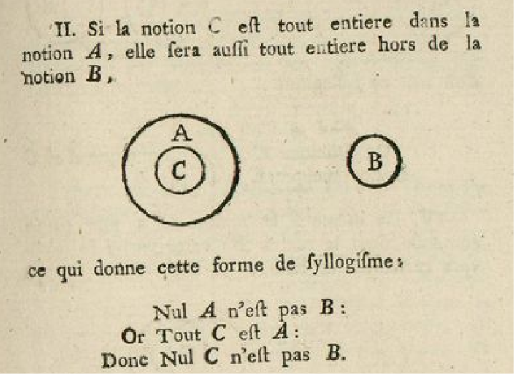
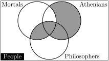
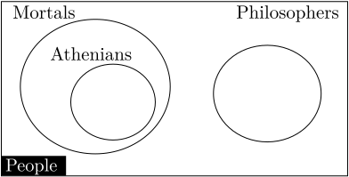
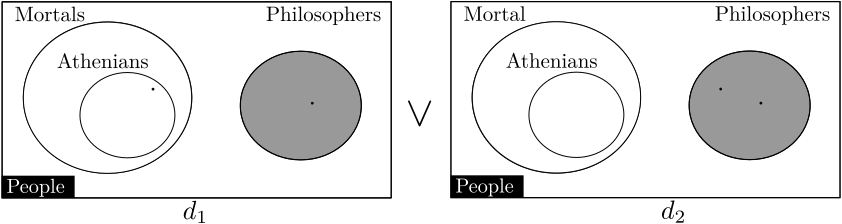

title:
class: big
image: images/tardis.jpg

---

title:
class: big
image: images/telefon.png

---

title: Historical
class: big
image: images/SchoolOfAthens.jpg
content_class: flexbox vcenter

---

title: Euclid's Diagrammatic Proof
subtitle:
class: big
image: images/euclid.jpg

---

title: Leonhard Euler
subtitle:
class: big
image: images/Torgau.jpg

---

title: John Venn
subtitle:
class: big
image: images/Everett-Millais.jpg

---

title: Gottlob Frege
image: images/vanGogh.jpg

---

title: C.S. Peirce
image: images/Klimt.jpg

---

title:
image: images/vanderLeck.jpg
class: big
build_lists: true

- G&ouml;del
- Zermelo, Fraenkel, Skolem, Tarski
- Turing

---

title: John Sowa & Sun-Joo Shin
image: images/Bacon.jpg

---

title: Modern Developments
image: images/Banksy.jpg
class: big

 <ul>
 <li>Brighton</li>
    <ul>
    <li>John Howse</li>
    <li>John Taylor</li>
    <li>Gem Stapleton</li>
    </ul>
 <li>Kent</li>
    <ul>
    <li>Stuart Kent</li>
    <li>Simon Thompson</li>
    <li>Peter Rodgers</li>
    </ul>
 </ul>

 <ul>
  <li>Stanford</li>
    <ul>
      <li>Nik Swoboda</li>
      <li>Gerard Allwein</li>
      <li>Jon Barwise</li>
      <li>Dave Barker-Plummer</li>
    </ul>
  <li>Technion</li>
    <ul>
      <li>Yossi Gil</li>
    </ul>
  </ul>

---

title: Recap
class: segue dark nobackground

---

title: Euler Diagrams
content_class: flexbox vcenter big

Visualise the relationship between sets.

---

title: Venn Diagrams
content_class: flexbox vcenter big

<blockquote style="font-size:16pt;">
"The [diagrammatic scheme] here offered may be said to underlie Boole's method, and to be the appropriate diagrammatic representation for it." (Venn, 1880)
</blockquote>

<footer class="source">John Venn, On the diagrammatic and mechanical representation of propositions and reasonings, Dublin Philosophical Magazine and Journal of Science, 1880.</footer>
---

title: Modern Euler Diagrams
content_class: flexbox vcenter

---

title: Properties of Euler Diagrams
class: big

- WISWYG
    * 1-to-1 mapping between contous and the sets that they represent.
- Free Rides (Shimojima, 1999)
    * Philosophers are not Mortal!

<footer class="source">Atsushi Shimojima, Derivative Meaning in Graphical Representations, IEEE VL, 1999.</footer>
---

title: Syllogistic Reasoning using Euler Diagrams
class: med

- The major premise "No mortals are philosophers" is represented by the contour denoting "Mortals" being disjoint from the contour denoting "Philosophers''.
- The minor premise "Every Athenian is mortal" is represented by the containment of the contour denoting "Athenians" within the contour denoting "Mortals''.
- The conclusion "Therefore no philosopher is Athenian" is clear due to the contours denoting "Athenians" and denoting "Philosophers" being disjoint.

---

title: Syllogistic Reasoning
class: big

- Diagrams can assist in Syllogistic reasoning (Sato et al, 2010).
- Are we reasoning using diagrams or sententially?

<footer class="source">Yuri Sato and Koji Mineshima and Ryo Takemura, The Efficacy of Euler and Venn Diagrams in Deductive Reasoning: Empirical Findings, Diagrams, 2010.</footer>

---

title: Spider Diagrams
content_class: flexbox vcenter

---

title: Spider Diagrams
content_class: flexbox vcenter

---

title: Diagrammatic Reasoning
class: big

- Spider Diagram reasoning system is sound and complete (Howse et al., 2005)
- Previous examples show an application of the "split spiders" rule.

<footer class="source">John Howse, Gem Stapleton and John Taylor, "Spider Diagrams", London Mathematical Soc, 2005.</footer>

---

title: Intuition into Completeness Proof
class: big

- Each diagram has a minimal unique normal form.
- Given two diagrams \\(D_1\\) and \\(D_2\\) we
    * add all contours to each,
    * add all missing zones to each,
    * split all the spiders,
    * combine expressions.
- Similar to proof strategy by Molina, 2000.
- Purely an application of diagrammatic rules.

<footnote class="source">John Howse, Fernando Molina and John Taylor, "SD2: A sound and complete diagrammatic reasoning system", IEEE VL, 2000.</footnote>

---

title: Expressiveness of Spider Diagrams
content_class: big

Spider Diagrams are as expressive as:

- monadic first order logic with equality (Howse, 2005).
- commutative star-free regular languages (Delaney et al., 2013).
- Spider Diagrams are weakly expressive.

---

title: Reasoning Example
content_class: flexbox vcenter

<footer class="source">Rodgers, P.: A survey of euler diagrams. Journal of Visual Languages and Computing 25, 134–155 (2014)</footer>

---

title: Expressive Diagrammatic Reasoning
class: segue dark nobackground

---

title: Motivation for Expressive Diagrammatic Reasoning
content_class: flexbox vcenter

---

title: A Software Engineering Example
class: big
content_class: flexbox vcenter

---

title: Concept Diagrams
content_class: flexbox vcenter

---

title: Concept Diagrams Expressiveness
class: big

- Concept Diagrams are at least as expressive as \\(\mathcal{SHOIN}\\).

---

title: Future Work & Conclusion
class: segue dark nobackground

---
title: Future Work on Euler Diagrams
class: big
image: images/ed-layout.svg

- Layout is an unsolved problem.
- Preference and Efficacy is currently being studied.

---
title: Future Work on Spider Diagrams
class: big

- Linking Spider Diagrams of Order and LTL

---
title: Future Work on Concept Diagrams
class: big

- Tie down expressiveness result.
- More work on patterns.
- Prototype implementation.

---

title: Conclusion
class: big

- We have considered some of the work on Euler diagram based logics over the past 20 years.
- Fully formal (but usable) diagrammatic reasoning systems.
- For this talk I've ignored interesting work on
    * diagram layout,
    * diagram comprehension,
    * spider diagrams of order,
    * second order spider diagrams,
    * generalised constraint diagrams, and
    * any non-Brighton work on visual logic.
